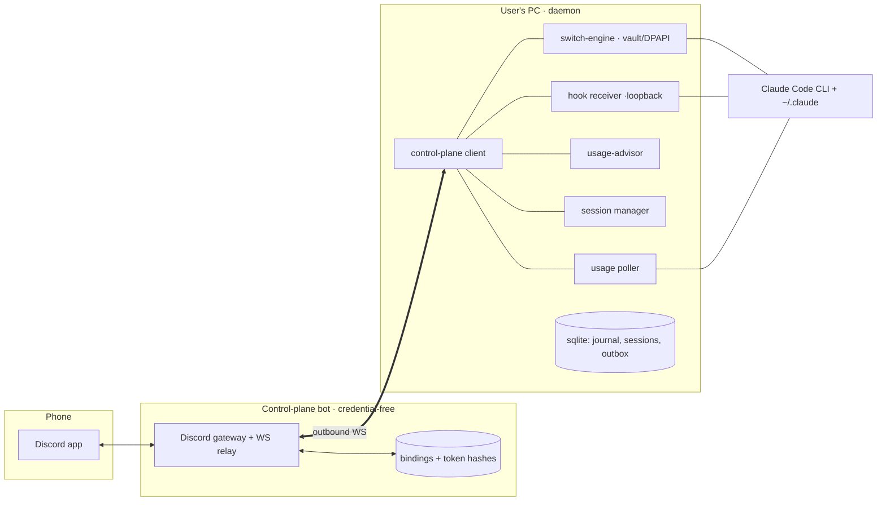

# Architecture

## The shape

Each **user** runs a **daemon** on their own machine. The daemon owns that user's 3–5
Claude accounts: their encrypted credentials, the switch engine, usage polling, live
sessions, and a loopback hook receiver. A single **control-plane bot** (one shared
Discord app) is the phone-facing surface. The bot holds **no credentials** and
**persists no session content** — it stores only which Discord user is bound to which
daemon, plus a hash of each daemon's token, and it routes messages strictly by Discord
user id. It does, in transit, see the content it must render into your phone cards
(commands, tool output, prompts, session text); only your Anthropic tokens are
structurally kept from it. See the trust model below and `docs/SELF_HOST.md`.

Daemons connect **outbound** to the bot over a WebSocket, so nothing listens on an
inbound port and everything works behind NAT. Local Claude Code use never depends on
the bot being up; the phone control is purely additive.

## Packages and dependency direction

Dependencies point **one way**, and the bot sits at the top of that order so it
_cannot_ reach credential code:

| Package             | Depends on                                                     | Role                                                           |
| ------------------- | -------------------------------------------------------------- | -------------------------------------------------------------- |
| `shared-protocol`   | —                                                              | zod-validated wire envelope + message union + codec.           |
| `switch-engine`     | —                                                              | account vault (DPAPI), OAuth refresh, atomic switch, recovery. |
| `usage-advisor`     | —                                                              | pure burn-down optimizer: which account to use now.            |
| `session-runtime`   | Agent SDK                                                      | managed + observed Claude sessions behind one interface.       |
| `daemon`            | shared-protocol, switch-engine, usage-advisor, session-runtime | wires it all together; owns state.                             |
| `control-plane-bot` | **shared-protocol only**                                       | Discord bot + WS relay; zero credentials.                      |
| `cli` (`cctl`)      | shared-protocol, switch-engine, daemon                         | local command-line control.                                    |

The rule **"`control-plane-bot` imports only `shared-protocol`"** is what makes
"the bot holds zero credentials" a structural fact rather than a promise.

## Trust model

- **Credentials never leave the user's machine.** Access/refresh tokens live only in
  the DPAPI-encrypted vault (`%LOCALAPPDATA%\claude-control\vault`) and, transiently,
  in the live files the CLI reads. They never enter a protocol message, the bot, or
  Discord.
- **What may cross the wire (and is therefore visible to whoever operates the bot):**
  usage percentages, the burn-down plan, session output and summaries, the prompts you
  send, control commands, and permission prompts/decisions — the last of which carry the
  literal tool input, so a shell command's text, a file path, and the contents of a
  Write/Edit all transit in cleartext. Never an OAuth token. On the shared default relay
  that operator is us; self-host (`docs/SELF_HOST.md`) to keep that content on
  infrastructure you control.
- **ACL is enforced twice.** The bot routes every interaction by
  `interaction.user.id`; the daemon re-validates on ingress. A user literally cannot
  name another user's daemon, and the bot can only resolve request ids the daemon
  already tracks — it can never fabricate an approval.
- **Daemon tokens** are 256-bit random, sent once at pairing, and stored only as a
  scrypt hash on the bot; verification is constant-time.

## Key mechanisms

- **Switch (M0).** `switch-engine.activate(id)` runs under a cross-process file lock:
  snapshot the current live creds → reconcile (adopt the previous account's token if
  the CLI rotated it under us) → refresh the target if near expiry and persist the
  rotated single-use token immediately → atomically write both `.credentials.json` and
  the `oauthAccount` block of `~/.claude.json` → read back and verify → commit. A
  write-ahead intent makes every step crash-recoverable (`recover()` rolls forward if
  the new creds are already live, else back to an encrypted snapshot).
- **Usage.** Tier-0 reads each profile's cached `cachedUsageUtilization` for free;
  tier-1 hits the OAuth usage endpoint. Cross-account visibility never requires
  switching, and the poller degrades to cached data (labelled stale) rather than
  crashing on an endpoint change.
- **Burn-down advice.** `usage-advisor.computePlan` ranks accounts so soon-to-reset
  unused quota gets burned before it evaporates, near-cap accounts are avoided, and an
  exhausted live account triggers a "switch now" advisory — all deterministic.
- **Attribution.** Transcripts carry no account identity, so the switch engine's
  append-only audit trail (`switch-audit.jsonl`) records when each account was live;
  the daemon joins it against transcript timestamps.
- **Sessions.** Phone-started work runs as an Agent-SDK **managed** session (clean
  structured streaming to Discord); a user's own terminal is a **observed** ConPTY
  session (notify/approve/inject only). Switching mid-session interrupts, activates,
  and resumes via `claude --resume`.

## State

The daemon persists to `node:sqlite` (`daemon.db`): the attribution journal, usage
snapshots, pending permissions, the session registry, and a bounded outbox that buffers
messages during a bot outage. The switch engine keeps its own file-based vault, intent,
and audit trail so it works even when the daemon isn't running (e.g. from `cctl`).
