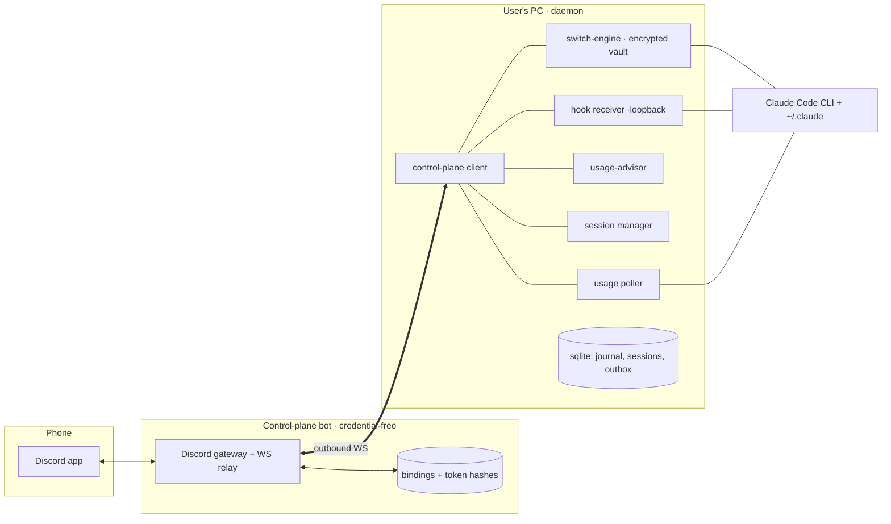

# Architecture

## The shape

Each **user** runs a **daemon** on their own machine. The daemon owns that user's 3–5
Claude accounts: their encrypted credentials, the switch engine, usage polling, live
sessions, and a loopback hook receiver. A single **control-plane bot** (one shared
Discord app) is the phone-facing surface. The bot holds **no credentials** and
**persists no session content** — it stores only which Discord user is bound to which
daemon, plus a hash of each daemon's token, and it routes messages strictly by Discord
user id. It does, in transit, see the content it must render into your phone cards
(commands, tool output, prompts, session text); only your Anthropic tokens are
structurally kept from it. See the trust model below and `docs/SELF_HOST.md`.

Daemons connect **outbound** to the bot over a WebSocket, so nothing listens on an
inbound port and everything works behind NAT. Local Claude Code use never depends on
the bot being up; the phone control is purely additive.

```mermaid
flowchart LR
  subgraph Phone
    D[Discord app]
  end
  subgraph Bot host [Control-plane bot · credential-free]
    B[Discord gateway + WS relay]
    K[(bindings + token hashes)]
  end
  subgraph User machine [User's PC · daemon]
    G[control-plane client]
    SE[switch-engine · encrypted vault]
    UP[usage poller]
    UA[usage-advisor]
    SM[session manager]
    HR[hook receiver ·loopback]
    DB[(sqlite: journal, sessions, outbox)]
  end
  CC[Claude Code CLI + ~/.claude]

  D <--> B
  B <--> K
  B <== outbound WS ==> G
  G --- SE & UP & UA & SM & HR
  SE --- CC
  HR --- CC
  UP --- CC
```

## Packages and dependency direction

Dependencies point **one way**, and the bot sits at the top of that order so it
_cannot_ reach credential code:

| Package             | Depends on                                                     | Role                                                             |
| ------------------- | -------------------------------------------------------------- | ---------------------------------------------------------------- |
| `shared-protocol`   | —                                                              | zod-validated wire envelope + message union + codec.             |
| `switch-engine`     | —                                                              | encrypted account vault, OAuth refresh, atomic switch, recovery. |
| `usage-advisor`     | —                                                              | pure burn-down optimizer: which account to use now.              |
| `session-runtime`   | Agent SDK                                                      | managed + observed Claude sessions behind one interface.         |
| `daemon`            | shared-protocol, switch-engine, usage-advisor, session-runtime | wires it all together; owns state.                               |
| `control-plane-bot` | **shared-protocol only**                                       | Discord bot + WS relay; zero credentials.                        |
| `cli` (`cctl`)      | shared-protocol, switch-engine, daemon                         | local command-line control.                                      |

The rule **"`control-plane-bot` imports only `shared-protocol`"** is what makes
"the bot holds zero credentials" a structural fact rather than a promise.

## Trust model

- **Credentials never leave the user's machine.** Access/refresh tokens live only in
  the encrypted vault (Windows: DPAPI at `%LOCALAPPDATA%\claude-control\vault`;
  Linux: file-key at `~/.local/share/claude-control/vault` — see `docs/PLATFORM.md`)
  and, transiently, in the live files the CLI reads. They never enter a protocol
  message, the bot, or Discord.
- **What may cross the wire (and is visible to the bot operator):**
  usage percentages, the burn-down plan, session output and summaries, the prompts you
  send, control commands, and permission prompts/decisions — the last of which carry the
  literal tool input, so a shell command's text, a file path, and the contents of a
  Write/Edit all transit in cleartext. **Never an OAuth token.** On the shared default relay
  that operator is us; self-host (`docs/SELF_HOST.md`) to keep that content on
  infrastructure you control.
- **ACL is enforced twice.** The bot routes every interaction by
  `interaction.user.id`; the daemon re-validates on ingress. A user literally cannot
  name another user's daemon, and the bot can only resolve request ids the daemon
  already tracks — it can never fabricate an approval.
- **Daemon tokens** are 256-bit random, sent once at pairing, and stored only as a
  scrypt hash on the bot; verification is constant-time.

## Key mechanisms

- **Switch (M0).** `switch-engine.activate(id)` runs under a cross-process file lock:
  snapshot the current live creds → reconcile (adopt the previous account's token if
  the CLI rotated it under us) → refresh the target if near expiry and persist the
  rotated single-use token immediately → atomically write both `.credentials.json` and
  the `oauthAccount` block of `~/.claude.json` → read back and verify → commit. Any
  failure after the first live write undoes the switch before the error surfaces: the
  previous login goes back (identity, then credentials), unless another writer's token
  landed meanwhile, which stays live and is stored in no bundle. A write-ahead intent per
  slot, recorded before the first live write, makes every step crash-recoverable: `recover()`
  at startup, and every locked operation on a slot, looks at its live files and completes or
  undoes the switch (undoing it when completing needs a write that cannot be made, or when the
  target no longer belongs to that slot). A switch that can be neither is reported, refuses
  writes to its slot and operations on the two accounts it was between, and is retried until it
  settles; everything else still runs. Which slot a switch targets is decided under the same
  lock, so a bind or unbind that lands first can never have a switch write an account into a
  slot it just left. Rotation adoption never stores a live token that another account's bundle
  already holds, and a token two accounts store is never seated in any slot.
- **Usage.** Tier-0 reads each profile's cached `cachedUsageUtilization` for free;
  tier-1 hits the OAuth usage endpoint. Cross-account visibility never requires
  switching, and the poller degrades to cached data (labelled stale) rather than
  crashing on an endpoint change.
- **Overload retries.** An HTTP 529 from the token or usage endpoint is retried in place for
  a few seconds — patience tuned by status.claude.com, never gated on it. The budget is a
  deadline each retry runs under, not merely a gate on starting one, and the refresh path (whose
  retries happen while holding the credential lock) caps it lower again, so the lock is never
  held near its stale-reclaim window or long enough to time out a waiting switch. Real
  persistence stays with the callers that already re-attempt on their own schedule.
- **Burn-down advice.** `usage-advisor.computePlan` ranks accounts so soon-to-reset
  unused quota gets burned before it evaporates, near-cap accounts are avoided, and an
  exhausted live account triggers a "switch now" advisory — all deterministic.
- **Attribution.** Transcripts carry no account identity, so the switch engine's
  append-only audit trail (`switch-audit.jsonl`) records when each account was live;
  the daemon joins it against transcript timestamps.
- **Token stats.** Claude Code writes a per-turn `usage` block into its own transcripts.
  `transcriptTokens` streams those files (de-duplicated by `message.id`, since one API
  response spans several lines and a resumed session copies its history) and
  `tokenStats` attributes each turn through the intervals above — the absolute counts
  behind `cctl stats` and `/stats`. Local reads only; the bot receives sums, never text.
  Everything the machine did outside Claude Code on this host is invisible, and every
  surface says so. The daemon pushes a 7-day snapshot on a slow cadence, which is what a
  bare `/stats` renders; `/stats days:N` is the one command that round-trips
  (`stats.request` → `stats.result`) because a window nobody has scanned yet cannot be
  answered from a cache. One scan runs at a time — the disk is the shared resource.
- **Sessions.** Phone-started work runs as an Agent-SDK **managed** session (clean
  structured streaming to Discord); a user's own terminal is a **observed** ConPTY
  session (notify/approve/inject only). Switching mid-session interrupts, activates,
  and resumes via `claude --resume`.

## Folder-bound accounts

A session's account is decided by one thing: the config dir it runs in
(`CLAUDE_CONFIG_DIR` at launch). Everything else — the `env` block in settings, a project
API-key token — Claude Code ignores once a login is stored. So binding a folder to an
account is, mechanically, launching its sessions in a different config dir that holds that
account's login. That dir is a **slot**.

- **Slots.** The **global slot** is today's config dir (`~/.claude` or `CLAUDE_CONFIG_DIR`)
  and holds the shared account. Each bound group gets a **group slot**: a **profile dir**
  under `<machine-local data>/claude-control/profiles/<groupId>/`. An account is live in at
  most one slot at a time — Claude Code rotates a refresh token on use, so the same login
  cannot be live in two dirs without one corrupting the other. Swapping a slot's
  `.credentials.json` reaches its running sessions in about two seconds, which is what makes
  an in-set auto-switch work exactly like the global switch, but scoped.
- **Profile dirs.** A profile is not a copy of `~/.claude`; it is a dir whose
  account-neutral entries are **shared** back to main and whose account-specific ones are
  its own. Content dirs (`projects`, `plugins`, `skills`, `agents`, `commands`, `todos`,
  `sessions`, …) are directory junctions (Windows) or symlinks (POSIX) to main, so
  memories, skills and history are one set of files no matter which account a session runs
  on. Root files that are account-neutral (`settings.json`, `CLAUDE.md` and other root
  `*.md`, `keybindings.json`, `history.jsonl`) are **hardlinks** to main — one inode, so an
  edit through either name is seen by both; the link is re-verified on every materialize and
  repaired newest-wins if Claude Code's temp-and-rename write ever severs it. Account-scoped
  dirs (`statsig`, `logs`, `backups`, `telemetry`, the daemon's own runtime, …) stay
  profile-local. `.claude.json` is **profile-owned**: the profile keeps its own
  `oauthAccount`, and only an allowlist of account-neutral keys (onboarding flags, theme,
  `mcpServers`, migration markers) is merged main → profile — never the reverse. Trust flows
  one way too: a project's `hasTrustDialogAccepted` propagates main → profile, never back.
- **The reservation fence.** A reserved account's registry row is physically **moved out**
  of `accounts.json` into a separate `groups.json`. This is the load-bearing downgrade-safety
  move: an older cctl (the installed daemon may predate this feature) rewrites `accounts.json`
  from only `{activeId, accounts}` and refreshes the tokens of every account it can see. It
  must never see a reserved account — or it would poll it, refresh its single-use token, or
  switch to it, silently breaking a binding. Because the row lives in a file the old code does
  not know about, its writes cannot touch it. `groups.json` records each group's members
  (their full rows), its folders, and which member is live in its slot. A row found in both
  files (a crash mid-move) resolves to the `groups.json` copy and heals on the next write.
- **The guard.** A binding is only useful if a session in the wrong account is caught. A
  dependency-free `UserPromptSubmit` hook (installed beside the relay forwarder, which keeps
  its own never-block contract) reads a non-secret snapshot — `folder-bindings.json`, written
  last in every binding change — and compares the session's config dir and project dir
  against it. A bound folder on the shared account, or a group slot used against an unbound
  folder, is blocked (or warned, or ignored, per the enforce mode). The guard fails **open**:
  any internal error, a missing or unparseable snapshot, or an unknown schema version exits 0
  and lets the prompt through. It prevents accidents; it is not a security boundary (see
  `docs/THREAT_MODEL.md`).
- **One engine, one lock.** The switch engine became slot-aware rather than being duplicated:
  the same `activate` / recovery / adoption / identity-guard machinery runs per slot, all
  under one cross-process lock, so no two slots can be written at once and every slot is
  crash-recoverable the same way the global one always was. A doctor pass (`checkSlots`)
  detects the invariant violations — an account live in two slots, a reserved account in
  global, a non-member in a group slot, a drifted active id, a broken profile link — and a
  repair pass fixes them by adopting the freshest token and re-seating each slot's rightful
  account.

## State

The daemon persists to `node:sqlite` (`daemon.db`): the attribution journal, usage
snapshots, pending permissions, the session registry, `pending_steering`, and a bounded
outbox that buffers messages during a bot outage. Both growing tables are bounded — the
outbox by row count, usage snapshots by a 90-day cutoff trimmed on each poll cycle. The
switch engine keeps its own file-based vault, intent, and audit trail so it works even when
the daemon isn't running (e.g. from `cctl`).

**`pending_steering` holds prompt bodies in plaintext**, and it is the one table here whose
contents are the operator's own words rather than metadata about them. A prompt gets a row
the moment cctl accepts it and keeps it until the session receives it or cctl gives up —
across restarts, reboots and crashes — because the phone was told the text would be
delivered and an in-memory queue answered that promise with silence. One row per prompt for
its whole life: the `kind` column says which path currently owns it (`interactive` for a
registered terminal session's next turn boundary, `managed` for an SDK session's next idle
turn, `channel` for a live MCP channel server about to collect it), and moving between paths
is an update of that column, never a delete and a re-insert. A prompt that falls off a
closing channel becomes an `interactive` row; a channel attaching for that session takes its
rows back, which is what stops a prompt waiting on a turn boundary an idle session never
reaches. `daemon.db` therefore deserves the same handling as the vault — it is not a cache.
